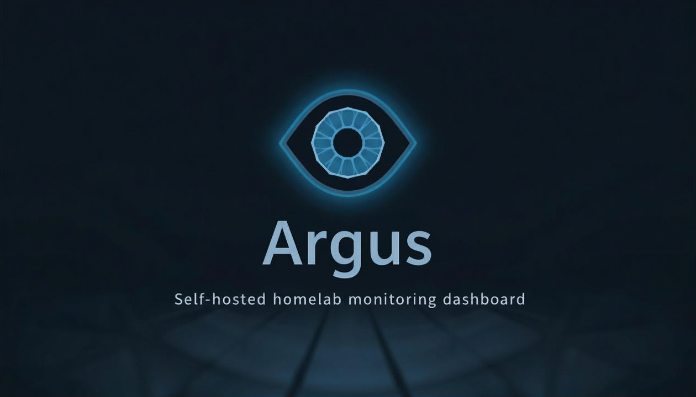
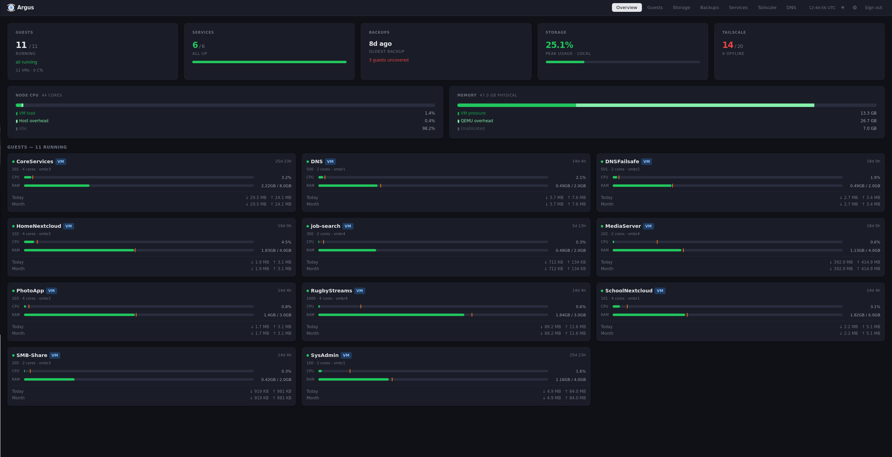
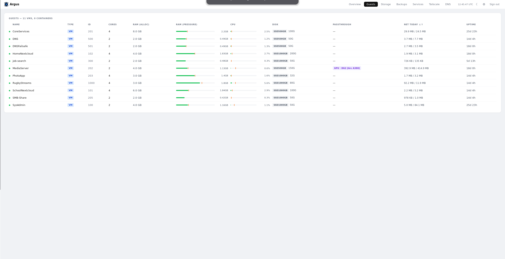
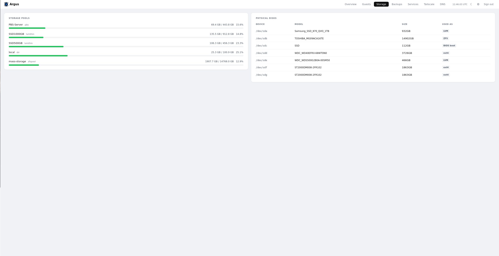
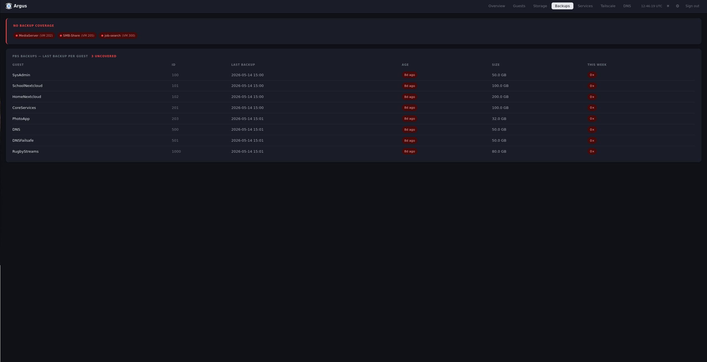
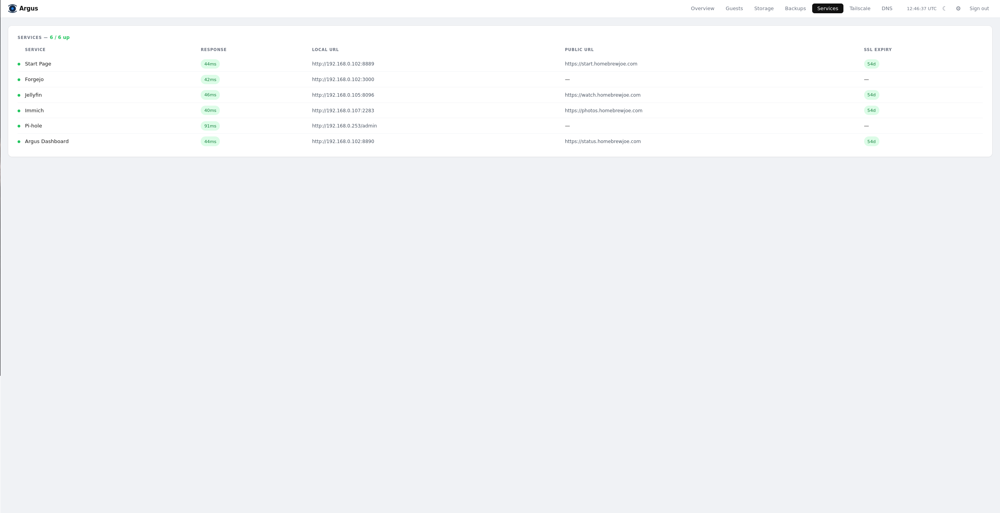
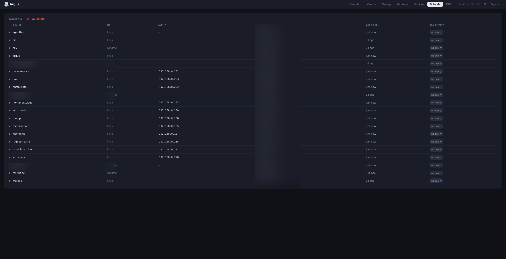
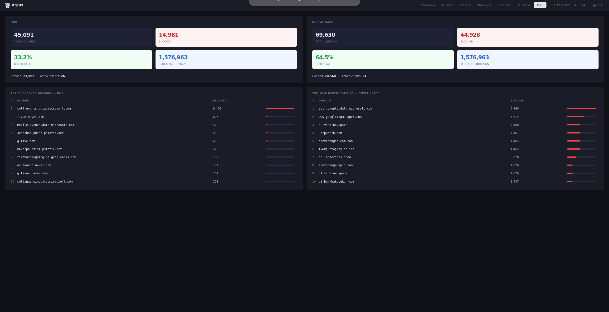

<p align="center">
  
</p>

A self-hosted homelab monitoring dashboard for Proxmox environments. Monitor your VMs and LXC containers, storage, PBS backups, Tailscale network, services, and Pi-hole DNS — all from one place, live-updating every 15 seconds. Configure everything from the built-in Settings UI — no config file editing required after first run.

**Integrations:** Proxmox · Proxmox Backup Server · Tailscale · Pi-hole v6

## Pages

| Tab | What it shows |
|---|---|
| Overview | Health summary cards + node CPU/RAM bars + VM/LXC card grid |
| Guests | VMs and LXC containers — status, RAM pressure, CPU%, disk, passthrough badges, daily net |
| Storage | Storage pools with usage bars + physical disk inventory + VM snapshot ages |
| Backups | PBS backup coverage warning + per-guest age and 7-day frequency |
| Services | Health checks with response time + SSL cert expiry |
| Tailscale | Device list — OS, LAN IP, Tailscale IP, last seen, key expiry |
| DNS | Pi-hole stats (queries, block rate, cache) + top 10 blocked domains per instance |
| Settings ⚙ | Configure all integrations from the UI — no restart needed |

## Screenshots

<table>
  <tr>
    <td></td>
    <td></td>
  </tr>
  <tr>
    <td></td>
    <td></td>
  </tr>
  <tr>
    <td></td>
    <td></td>
  </tr>
  <tr>
    <td colspan="2"></td>
  </tr>
</table>

## Requirements

- Proxmox VE (tested on PVE 8+)
- Docker + Docker Compose on your server
- Proxmox API token with `VM.Audit`, `Datastore.Audit`, `Sys.Audit` privileges
- QEMU guest agent running in your VMs (for RAM pressure and LAN IP discovery)

Pi-hole, Tailscale, and PBS are all optional — missing integrations show an empty state rather than an error.

## Quick start

**1. Clone and configure**

```bash
git clone https://github.com/Johannes1202/argus-dashboard.git
cd argus
cp .env.example .env          # fill in your values
cp config.yml.example config.yml   # fill in your services and device IPs
```

**2. Start**

```bash
docker compose up -d --build
```

Open `http://your-server:8890` — default password is in your `.env`.

## Configuration

### Secrets → `.env`

Copy `.env.example` to `.env` and fill in your Proxmox token, Tailscale API key, Pi-hole password, and a login password. See the comments in `.env.example` for details.

### Services and devices → `config.yml`

```yaml
# Non-VM devices that need a manual LAN IP.
# VMs are discovered automatically via the QEMU guest agent.
device_lan_map:
  proxmox: 192.168.1.10
  pbs:     192.168.1.11

# Services to health-check and link from the Network tab.
services:
  - name: My App
    local: http://192.168.1.100:8080
    public: https://myapp.example.com  # optional
```

You can also edit services and device IPs at runtime from the Settings tab — changes are saved without a restart.

### App title

Set `APP_TITLE=My Lab` in `.env` to rename the dashboard. Default is `Argus`.

## Deploy to a remote server

```bash
REMOTE=user@your-server REMOTE_DIR=~/argus ./deploy.sh
```

This rsyncs the source (excluding `.env`, `config.yml`, and `data/`) and rebuilds the container on the remote.

## Port

Default: `8890`. Change it in `docker-compose.yml`:

```yaml
ports:
  - "8890:8080"   # host:container
```

## Notes

- **No database** — state is in-memory. Restarting clears bandwidth counters and peak markers.
- **Self-signed Proxmox cert** — TLS verification is disabled for the Proxmox API connection.
- **Pi-hole v6 only** — uses the v6 session API. Pi-hole v5 is not supported.
- **Single node** — monitors one Proxmox node (set via `PROXMOX_NODE`). Multi-node clusters are not currently supported.
